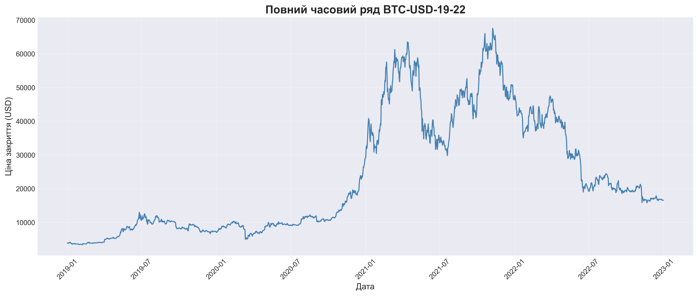
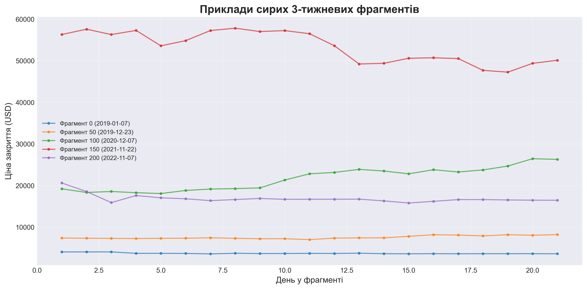
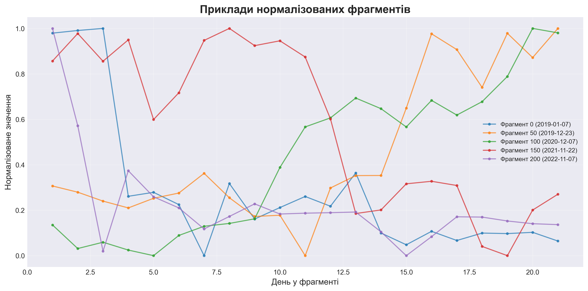
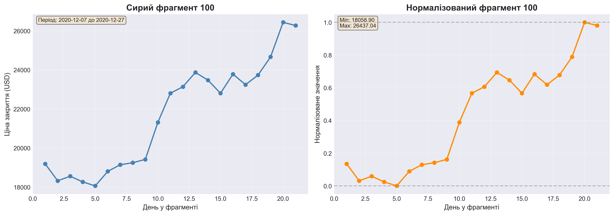
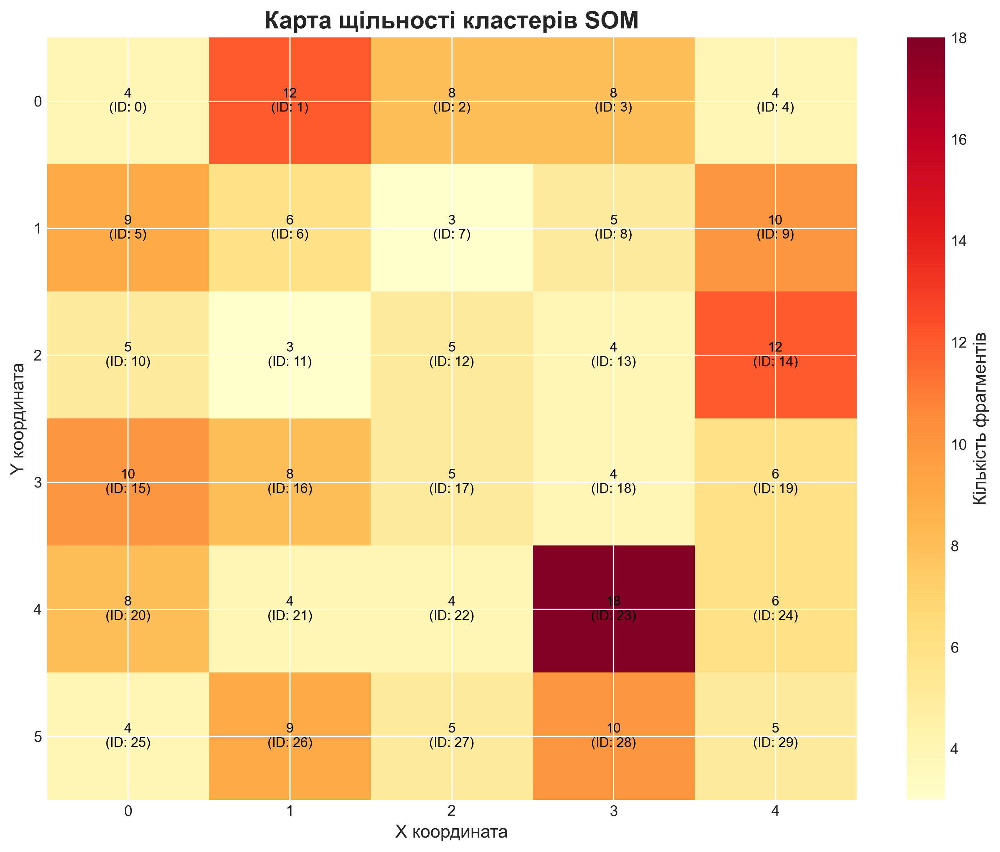
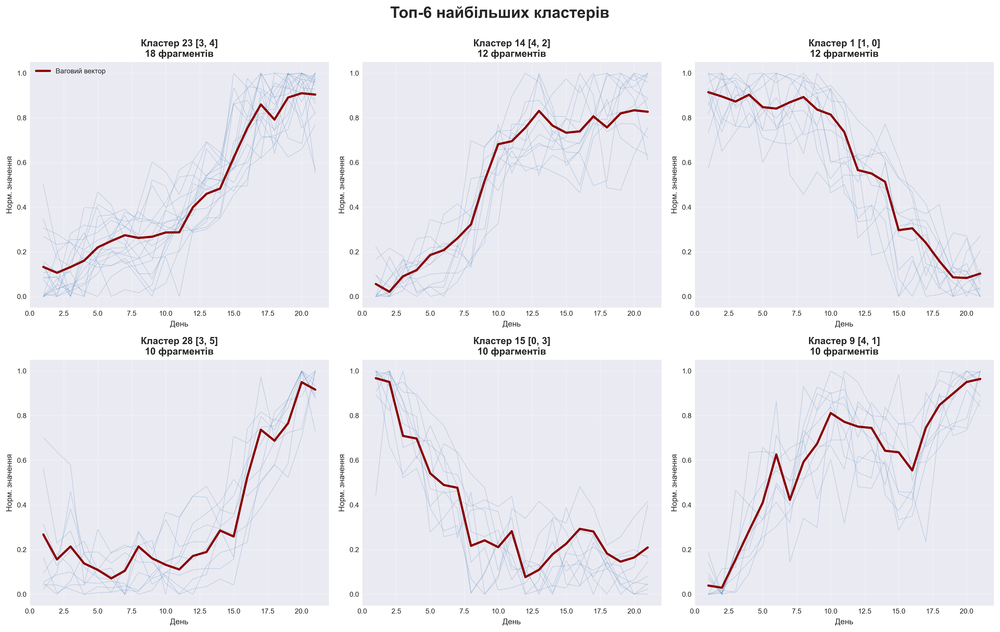
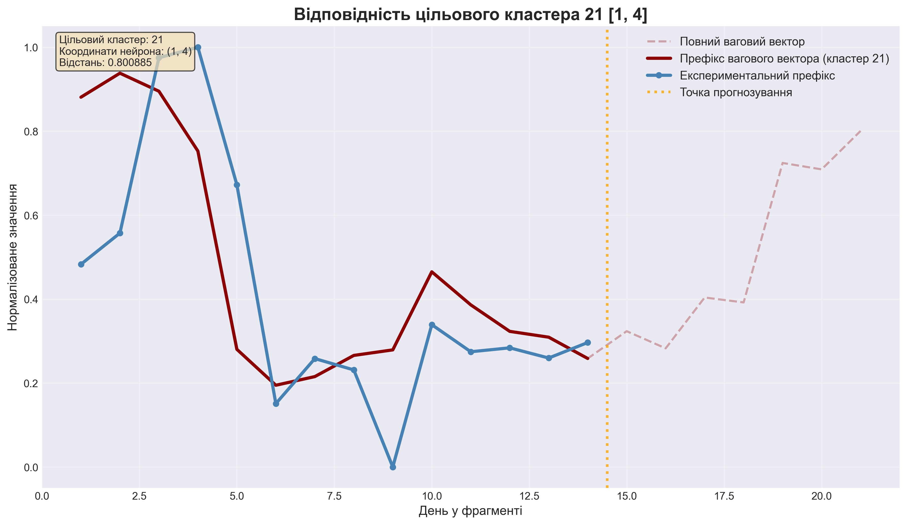
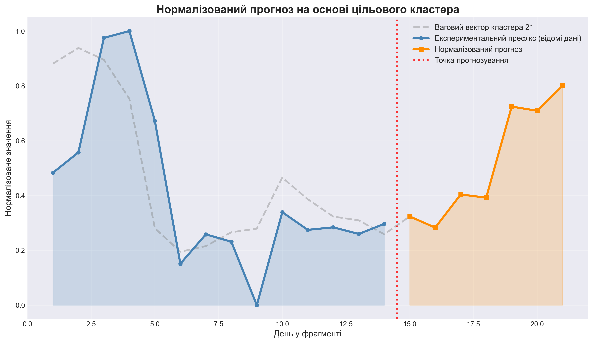
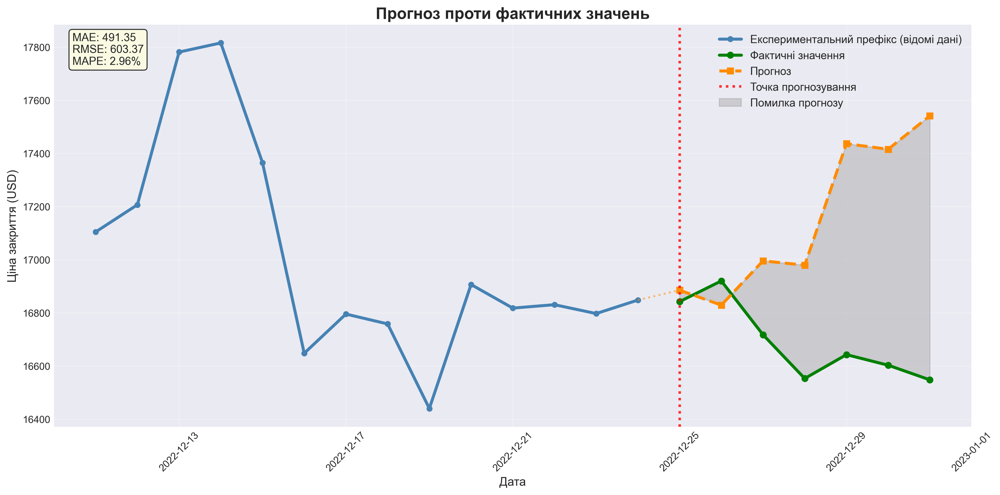
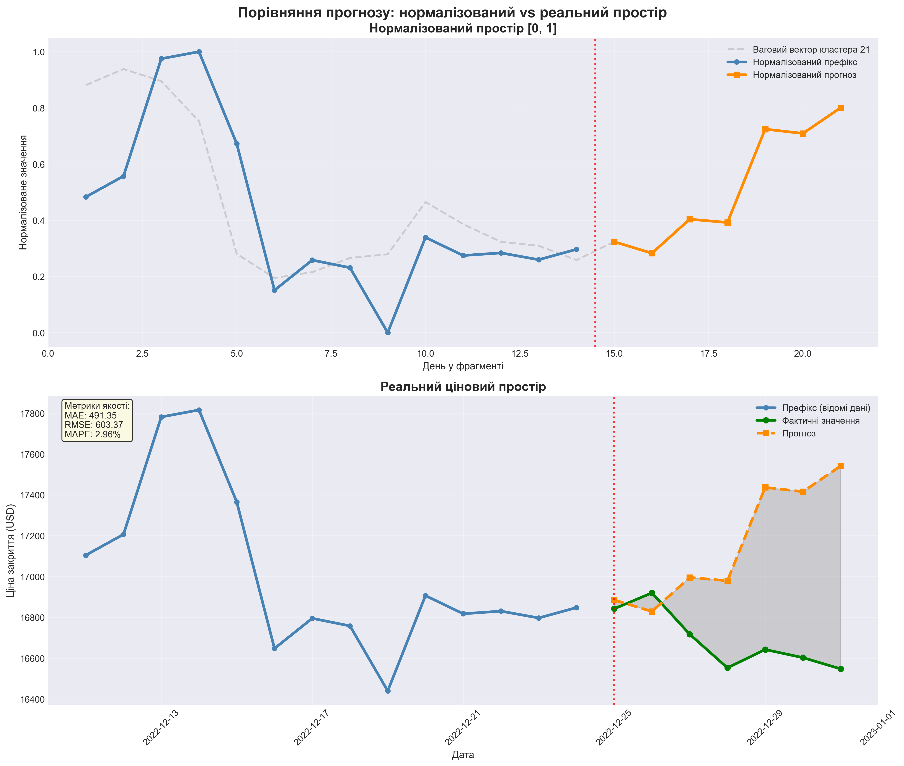

# Аналіз та прогнозування фінансових часових рядів

## Огляд проєкту

Цей проєкт реалізує повний конвеєр для інтелектуального аналізу та прогнозування фінансових часових рядів на основі історичних даних про денні котирування активу.

Система використовує:
- Фрагментацію часового ряду на 3-тижневі вікна (21 день)
- Незалежну нормалізацію кожного фрагменту
- Кластеризацію за допомогою самоорганізувальних карт (SOM / Kohonen)
- Прогнозування на основі типових патернів поведінки кластерів

## Основні характеристики

- **Довжина фрагменту**: 21 день (3 тижні)
- **Крок зміщення**: 7 днів (1 тиждень)
- **Довжина префіксу**: 14 днів (відома частина)
- **Горизонт прогнозу**: 7 днів (прогнозована частина)
- **Метод кластеризації**: SOM / Kohonen neural network
- **Джерело даних**: локальний CSV файл

## 🔄 Як змінити CSV файл

**Швидка інструкція:**

1. Покладіть ваш CSV файл у папку `data/raw/`
2. У ноутбуці `notebooks/final_lab.ipynb` (cell 4) змініть:
   ```python
   DATA_PATH = '../data/raw/ваш-файл.csv'
   ```
3. Запустіть ноутбук - назви у графіках оновляться автоматично!

📖 **Детальна інструкція:** [HOW_TO_CHANGE_CSV.md](HOW_TO_CHANGE_CSV.md)

**Вимоги до CSV:**
- Колонки `Date` та `Close` обов'язкові
- Щонайменше 2-3 роки щоденних даних

## Структура проєкту

```
big-data/
│
├── README.md              # Цей файл
├── requirements.txt       # Залежності Python
│
├── data/
│   └── raw/              # Вхідні дані (CSV файли)
│       └── BTC-USD.csv
│
├── notebooks/
│   └── final_lab.ipynb   # Основний notebook
│
├── src/
│   ├── data_loader.py    # Завантаження даних
│   ├── preprocessing.py  # Підготовка даних
│   ├── normalization.py  # Нормалізація
│   ├── clustering.py     # Кластеризація SOM
│   ├── forecasting.py    # Прогнозування
│   ├── metrics.py        # Метрики оцінки
│   └── visualization.py  # Візуалізація
│
└── results/
    ├── figures/          # Графіки візуалізації
    └── metrics/          # Метрики помилок (JSON, TXT)
```

## Вимоги до даних

Вхідний файл повинен бути CSV файлом з денними фінансовими котируваннями.

**Обов'язкові колонки:**
- `Date` - дата
- `Close` - ціна закриття

**Опціональні колонки:**
- `Open`, `High`, `Low`, `Adj Close`, `Volume`

**ВАЖЛИВО:** Система працює виключно з локальним CSV файлом. Автоматичне завантаження даних з інтернету не використовується.

## Встановлення

1. Клонуйте репозиторій або розпакуйте архів проєкту

2. Встановіть залежності:
```bash
pip install -r requirements.txt
```

## Використання

### Підготовка даних

Розмістіть ваш CSV файл з історичними даними в папку `data/raw/`:
```
data/raw/BTC-USD.csv
```

### Запуск аналізу

Відкрийте та виконайте Jupyter notebook:
```bash
jupyter notebook notebooks/final_lab.ipynb
```

Notebook виконає всі етапи конвеєра:
1. Завантаження локального CSV файлу
2. Підготовка часового ряду
3. Створення 3-тижневих фрагментів
4. Нормалізація фрагментів
5. Кластеризація за допомогою SOM
6. Пошук цільового кластера
7. Побудова прогнозу
8. Денормалізація прогнозу
9. Оцінка якості прогнозу (MAE, RMSE, MAPE)
10. Візуалізація результатів

## Методологія

### Створення фрагментів

Часовий ряд розбивається на перекриваючі фрагменти:
- Кожен фрагмент містить 21 денне значення
- Наступний фрагмент зміщується на 7 днів
- Фрагменти перекриваються на 14 днів

### Нормалізація

Кожен фрагмент нормалізується незалежно за формулою:
```
x_norm = (x_i - x_min) / (x_max - x_min)
```

де `x_min` та `x_max` - мінімум і максимум **поточного** фрагменту.

### Кластеризація

Використовується самоорганізувальна карта (SOM / мережа Кохонена):
- Розмір сітки: 5 x 6 (30 кластерів)
- Вагові вектори нейронів представляють типові патерни поведінки

### Прогнозування

1. Беруться останні 21 день як експериментальне зображення
2. Перші 14 днів (префікс) нормалізуються
3. Знаходиться найближчий ваговий вектор SOM за префіксом
4. Останні 7 значень цього вектора використовуються як нормалізований прогноз
5. Прогноз денормалізується до реальних цін
6. Порівнюється з фактичними 7 днями

## Результати

Після виконання ноутбуку генеруються візуалізації та метрики оцінки прогнозу.

### Візуалізації

Система створює 10 графіків, що демонструють весь процес аналізу та прогнозування:

#### 1. Повний часовий ряд


#### 2. Приклади сирих фрагментів


#### 3. Нормалізовані фрагменти


#### 4. Порівняння: сирі vs нормалізовані


#### 5. Теплова карта SOM


#### 6. Топ кластери


#### 7. Знайдений цільовий кластер


#### 8. Нормалізований прогноз


#### 9. Прогноз проти фактичних значень


#### 10. Сітка порівняння


### Метрики

Детальні метрики зберігаються в `results/metrics/`:
- `forecast_metrics.json` - структуровані дані (MAE, RMSE, MAPE) у форматі JSON
- `forecast_metrics.txt` - текстовий звіт з метриками та додатковою інформацією

## Важливі обмеження

- Система НЕ завантажує дані з інтернету автоматично
- Файл даних повинен вже бути присутнім в папці `data/raw/`
- `yfinance` не є обов'язковою залежністю проєкту
- Тренувальні дані не містять майбутніх значень з періоду прогнозу

## Автори

Проєкт виконано в рамках дисциплін:
- Аналітичні Big Data системи
- Інженерія даних та знань

## Ліцензія

Навчальний проєкт
